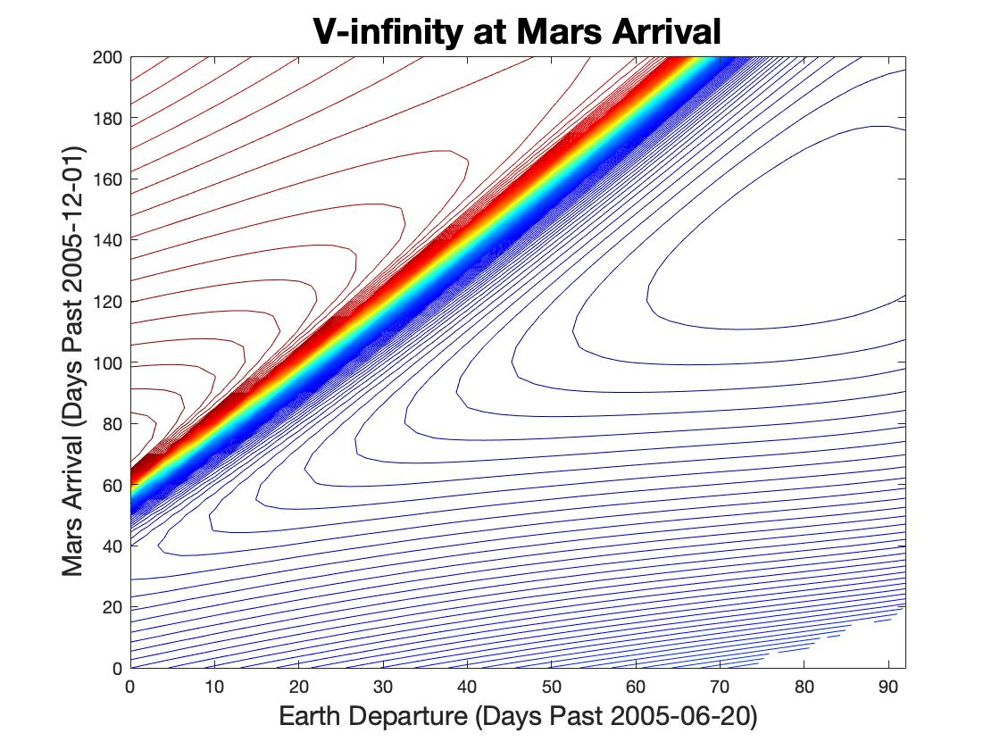

# ASEN 5050 - Astrodynamics

## Course Overview

This course focuses on studying the motion of celestial bodies and artificial satellites. Most of the course will focus on using the two-body problem as a model of the dynamical environment. Using this model, we will: study natural motions that follow conic sections, describe a state along its trajectory, and explore common state and time descriptions. We will leverage this foundation to design a variety of transfers for spacecraft using impulsive maneuvers. We will also extend these concepts to study relative motion between two spacecraft orbiting about a common central body and to understand the impact of additional forces.

## Content Information

The files in this repository contain final reports for each course assignement including MATLAB scripts for calculations.

Here's a cool Image from one of the Interplanetary Trajectory Reports

